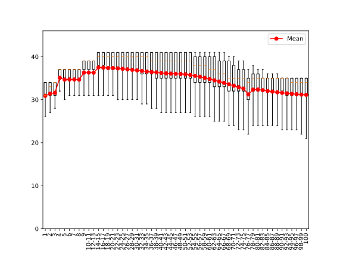

# `art_modern_utils`: Python Utilities for `art_modern`

`art-modern-utils` badges:
[](https://github.com/YU-Zhejian/art_modern_utils/releases)
[](https://www.gnu.org/licenses/)
[](https://github.com/psf/black)

`art-modern-utils` on PyPI:
[](https://www.python.org/downloads/)
[](https://pypi.org/project/art-modern-utils/)
[](https://pypi.org/project/art-modern-utils/)

[](https://doi.org/10.64898/2026.02.20.707060)

Here presents `art_modern_utils`, a collection of Python utilities for [`art_modern`](https://github.com/YU-Zhejian/art_modern). In detail, it contains:

## `art-profile-fastqc`: A Python script for generating a FASTQC-like report for ART-compatible error profiles

```text
$ art-profile-fastqc --help
usage: art_profile_fastqc.py [-h] [--version] [-i INPUT] [-o OUTPUT] [--dpi DPI] [--figwidth FIGWIDTH] [--figheight FIGHEIGHT]

Generate boxplot from ART profile quality distribution

options:
  -h, --help            show this help message and exit
  --version             show program's version number and exit
  -i INPUT, --input INPUT
                        Input file (default: stdin)
  -o OUTPUT, --output OUTPUT
                        Output figure file. If unset, the plot will be shown interactively.
  --dpi DPI             DPI of figure (default: 300)
  --figwidth FIGWIDTH   Figure width (default: 8in)
  --figheight FIGHEIGHT
                        Figure height (default: 6in)
```

Usage Example:

```shell
art-profile-fastqc --input ~/Documents/art_modern/data/Illumina_profiles/HiSeq2kL100R1.txt --output figs/HiSeq2kL100R1.txt.svg
```

Generating:



## `art-sam-validate`: A Python script for validating SAM/BAM files

This script can also be used to check whether the SAM/BAM files generated by aligners, etc., contain valid CIGAR strings that match what is specified in the reference sequence.

This script will work on sequences that are mapped to the opposite strand.

```text
$ art-sam-validate --help
usage: art-sam-validate [-h] ref alignment

Test whether a SAM/BAM is correct.

positional arguments:
  ref         Reference FASTA file
  alignment   Alignment BAM/SAM file

options:
  -h, --help  show this help message and exit
```

Usage Example:

```shell
art-sam-validate \
    ~/Documents/art_modern_benchmark_other_simulators/data/e_coli.fa \
    ~/Documents/art_modern_benchmark_other_simulators/data/e_coli_CNR0028307.bam
```

Output:

```text
4128472it [00:14, 283405.25it/s]
{'UNALIGNED': 376180, 'POS': 1877049, 'NEG': 1875243}
```

Meaning that there are 376,180 unaligned reads, with 1,877,049 and 1,875,243 reads aligned to the positive and negative strands, respectively. All reads are aligned without errors in the BAM file.

## Copyright

Copyright (C) 2025--2026 YU Zhejian

This program is free software: you can redistribute it and/or modify
it under the terms of the GNU General Public License as published by
the Free Software Foundation, either version 3 of the License, or
(at your option) any later version.

This program is distributed in the hope that it will be useful,
but WITHOUT ANY WARRANTY; without even the implied warranty of
MERCHANTABILITY or FITNESS FOR A PARTICULAR PURPOSE.  See the
GNU General Public License for more details.

You should have received a copy of the GNU General Public License
along with this program.  If not, see <https://www.gnu.org/licenses/>.

## News

## 1.0.3 (2026-04-12)

- `art-sam-validate`: Addded `allow-duplicated-cigar` and `allow-zero-length-cigar` options. Those options are disabled by default, they can be enabled to allow duplicated CIGAR strings and zero-length CIGAR strings, which are compliant with the SAM specification but looks weird.
- Miscellaneous bug fixes.

### 1.0.2 (2026-04-04)

- `art-profile-fastqc`: Detection of binned quality scores added.
- Miscellaneous bug fixes.

### 1.0.1 (2026-04-03)

- `art-profile-fastqc`: Figure width, height, and DPI added. Logger added.
- Miscellaneous bug fixes.

### 1.0.0 (2026-02-25)

- Miscellaneous bug fixes.

### 0.1.0 (2025-11-13)

- Initial release.
